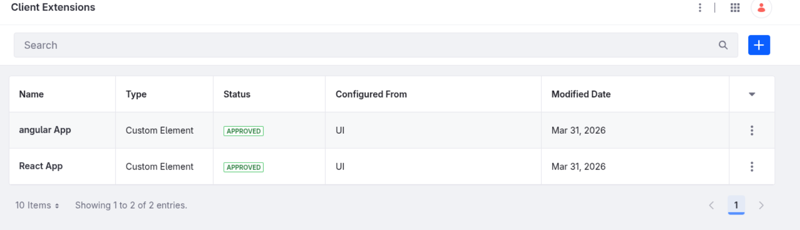

# 🚀 Ambiente Liferay + MFE (Angular/React)

Este projeto tem como objetivo subir um ambiente local do Liferay e
realizar o build e deploy dos MFEs (Micro Frontends) utilizando **act**.

------------------------------------------------------------------------

## 📋 Pré-requisitos

Antes de começar, você precisa ter instalado:

-   🐳 Docker\
-   🐳 Docker Compose\
-   ⚙️ Act (https://github.com/nektos/act)\
-   ☕ Java (17+)\
-   🧰 Blade CLI\
-   📦 Node.js + npm (para os MFEs, apenas build local)

------------------------------------------------------------------------

## 📂 Estrutura esperada

    /liferay
    /mfe-angular
    /mfe-react

------------------------------------------------------------------------

## ▶️ Subindo o ambiente Liferay

1.  Acesse a pasta do Liferay:

``` bash
cd liferay
```

2.  Execute o comando para iniciar o ambiente:

``` bash
blade gw clean dcinit
```

Esse comando irá:

-   Subir os containers necessários via Docker Compose
-   Inicializar o ambiente do Liferay

------------------------------------------------------------------------

## ⏳ Aguardar inicialização

Espere até que:

-   Todos os containers estejam **UP**
-   O Liferay esteja acessível no navegador

------------------------------------------------------------------------

## ⚙️ Build e Deploy dos MFEs

Após o ambiente estar pronto, execute os passos abaixo para cada MFE.

------------------------------------------------------------------------

### 📦 Angular MFE

``` bash
cd mfe-angular
act -j build
act -j deploy
```

------------------------------------------------------------------------

### ⚛️ React MFE

``` bash
cd mfe-react
act -j build
act -j deploy
```

------------------------------------------------------------------------

## 🧠 Observações

-   O `act` simula pipelines do GitHub Actions localmente
-   Certifique-se de que o Docker está rodando antes de executar o `act`
-   O deploy depende do ambiente do Liferay já estar disponível

------------------------------------------------------------------------

## ✅ Fluxo resumido

1.  Subir Liferay\
2.  Aguardar inicialização\
3.  Build + Deploy dos MFEs

